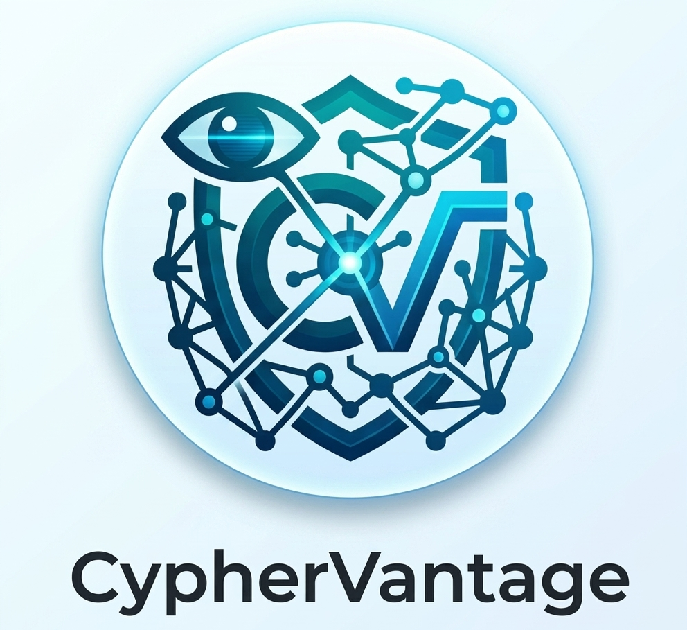

# CypherVantage

<p align="center">
  
</p>

<p align="center">
  <strong>Total visibility into your third-party ecosystem. Securing your connections.</strong>
</p>

---

## 🎯 Overview

**CypherVantage** is a cutting-edge, AI-driven Third-Party Risk Management (TPRM) platform designed to automate, monitor, and secure your vendor ecosystem. By combining advanced cryptography concepts with real-time attack surface mapping, CypherVantage gives security operations teams the ultimate high-ground perspective to proactively mitigate vendor vulnerabilities before they compromise your perimeter.

## ✨ Core Features

*   **Continuous Attack Surface Mapping:** 360-degree, real-time scanning of third-party digital footprints.
*   **Intelligent Risk Scoring:** Predictive, AI-driven risk models tailored to your organization's specific compliance requirements.
*   **Automated Vendor Assessments:** Dynamic questionnaire dispatch and automated evidence verification to eliminate compliance bottlenecks.
*   **Cryptographic Integrity Checks:** Advanced data security monitoring to ensure data shared across your supply chain remains tamper-proof.

## 🚀 Getting Started

### Prerequisites

Ensure your development environment meets the following baseline requirements:

*   **Node.js** (v18.0.0 or higher) or **Python** (v3.11 or higher)
*   **Docker** and **Docker Compose**
*   An active **CypherVantage API License Key**

### Quick Installation

1. **Clone the repository:**
```bash
   git clone [https://github.com/CypherVantageAI/core-platform.git](https://github.com/CypherVantageAI/core-platform.git)
   cd core-platform

