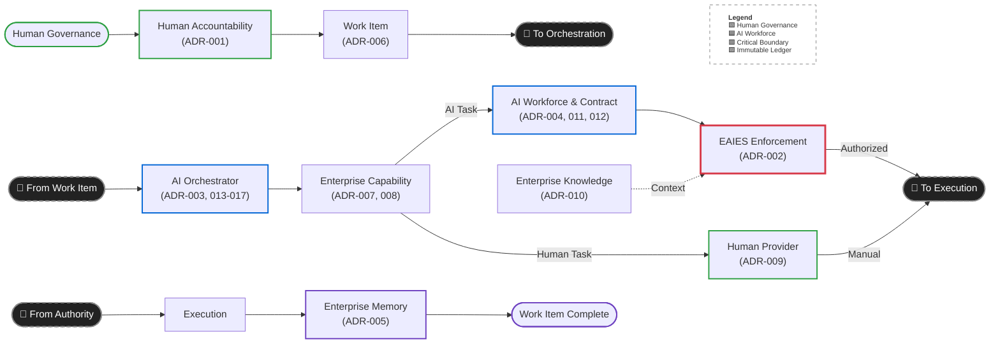

# CypherVantageAI

<p align="center">
  
</p>

<p align="center">
  <strong>Enterprise AI Systems Architecture, Distributed Agentic Orchestration & AI Governance</strong>
</p>

<p align="center">
  <a href="https://cyphervantageai.github.io/"></a>
  &nbsp;&nbsp;&nbsp;
  
  &nbsp;&nbsp;&nbsp;
  
  &nbsp;&nbsp;&nbsp;
  
</p>

---

## Building Enterprise AI Systems

**CypherVantageAI** is an engineering initiative focused on solving the fundamental architectural, distributed systems, and governance challenges of deploying autonomous AI agents in mission-critical enterprise environments.

As organizations transition from isolated conversational models to collaborative multi-agent workforces, the primary engineering risks shift from model capability to **systemic operational reliability**: ensuring that distributed workflows survive orchestrator crashes, that autonomous actions are strictly bounded by non-bypassable policy, that work can be deterministically traced across deep delegation trees, and that human operators retain ultimate accountability.

Our core framework, the **Enterprise AI Operating System (EAIOS)**, establishes the software primitives, contracts, and invariants required to run governed, durable, and resilient AI agent workforces at enterprise standards.

---

## The Problem: Beyond the Isolated Chatbot

Deploying an autonomous multi-agent system in a regulated enterprise is fundamentally an architectural and distributed systems problem, not simply an LLM integration exercise:

* **Long-Running Distributed Workflows**: Complex enterprise operations span hours or days, multiple asynchronous systems, and dozens of discrete tasks that cannot depend on volatile process memory.
* **Partial Failures & Crash Recovery**: If a worker node or orchestrator crashes mid-pipeline, the system must recover deterministically—resuming the exact runnable frontier rather than replaying completed non-idempotent side effects.
* **The Authority vs. Coordination Conflation**: Traditional workflow engines frequently conflate scheduling with authorization. In an agentic system, an execution plan must never be treated as an authorization token.
* **Uncontrolled Fan-Out & Runaway Recursion**: Multi-agent delegation without atomic admission control risks cascading spawn storms, race conditions, and exhausted system resources.
* **Auditability & Non-Repudiation**: Enterprise compliance demands an immutable, tamper-evident audit trail showing exactly which agent executed which capability, under whose authority, with what context, and at what timestamp.

EAIOS was engineered to address these failure modes from first principles.

---

## EAIOS: Enterprise AI Operating System

The **Enterprise AI Operating System (EAIOS)** is an architecture-led operating model and distributed orchestration framework. It defines how humans and AI Employees collaborate within verified governance, execution, and memory boundaries:

* **AI Employee Lifecycle**: Stateful AI identities with explicit capability profiles and enforceable lifecycle states (`ACTIVE`, `SUSPENDED`, `RETIRED`).
* **AI Service Contracts**: Machine-readable operational contracts specifying required capabilities, minimum confidence thresholds, and execution authority requirements.
* **Enterprise AI Execution Sovereignty (EAIES)**: An isolated, non-bypassable enforcement boundary that evaluates every capability invocation point-in-time.
* **Enterprise Memory**: An append-only, tamper-evident forensic ledger capturing all operational events, authorization checks, and state transitions.
* **Durable Orchestrator Runtime**: A distributed execution engine managing directed acyclic graph (DAG) evaluation, persistent worker leases, and crash recovery.

---

## Architectural Principles & Invariants

The EAIOS framework is anchored by strict architectural invariants:

1. **Coordination / Authority Separation**:
   $$\text{"Coordination may propagate work; authority must never propagate implicitly."}$$
   Workflow state coordinates operational sequencing; it never manufactures or caches execution authority.
2. **EAIES Boundary Sovereignty**: The EAIES proxy is the sole authority enforcement layer. Urgency, prior human approvals, workforce routing, or contextual metadata cannot override policy.
3. **Non-Transitive Delegation**: Delegation transfers work decomposition, not execution permissions. An agent cannot grant another agent permissions it does not possess.
4. **Optimistic Concurrency Control**: Concurrency is managed via version-based optimistic locking (`version += 1`) at the persistence layer, deliberately eliminating external distributed lock managers (e.g., Redis, ZooKeeper) to maintain clean failure boundaries.
5. **Real-World At-Least-Once Semantics**: The architecture explicitly recognizes that network boundaries preclude distributed exactly-once execution. EAIOS enforces at-least-once capability execution paired with attempt-scoped idempotency keys and deterministic deduplication.
6. **Human Accountability**: Autonomous agents perform bounded, repeatable tasks under contract. Accountable human operators retain authority over policy, high-risk actions, and ambiguous failure resolutions.

---

## Durable Agentic Workflow Architecture

The core of EAIOS is its four-stage workflow resilience architecture, engineered across a sequence of Architectural Decision Records (ADRs):

```
┌───────────────────────────────────────────────────────────────────────────────┐
│                   THE WORKFLOW RESILIENCE ARCHITECTURE JOURNEY                │
├─────────┬───────────────────────────────────┬─────────────────────────────────┤
│ Stage   │ Core Engineering Question         │ Implemented Mechanism           │
├─────────┼───────────────────────────────────┼─────────────────────────────────┤
│ ADR-014 │ Can work be admitted safely?      │ Distributed Admission Control   │
│         │                                   │ • Request idempotency keys      │
│         │                                   │ • Persistent rate-limit counters│
│         │                                   │ • Atomic parent-version locking │
│         │                                   │ • Active-child concurrency caps │
├─────────┼───────────────────────────────────┼─────────────────────────────────┤
│ ADR-015 │ Can work be traced?               │ End-to-End Traceability         │
│         │                                   │ • Globally unique correlation_id│
│         │                                   │ • Immutable lineage inheritance │
│         │                                   │ • Forensic Enterprise Memory    │
├─────────┼───────────────────────────────────┼─────────────────────────────────┤
│ ADR-016 │ Can individual execution survive  │ Distributed Work Item Resilience│
│         │ node failure?                     │ • Persistent execution leases   │
│         │                                   │ • Heartbeat crash sweeps        │
│         │                                   │ • Bounded retry budgets         │
│         │                                   │ • Absolute UTC deadlines        │
├─────────┼───────────────────────────────────┼─────────────────────────────────┤
│ ADR-017 │ Can the multi-step workflow       │ Durable Workflow Execution State│
│         │ itself survive crash?             │ • Versioned WorkflowDefinition  │
│         │                                   │ • Durable WorkflowInstance DAG  │
│         │                                   │ • Runnable frontier recovery    │
│         │                                   │ • Saga reverse compensation     │
│         │                                   │ • Deterministic HUMAN_REVIEW    │
└─────────┴───────────────────────────────────┴─────────────────────────────────┘
```

### How Durable Execution Works

1. **Declarative DAG Templates (`WorkflowDefinition`)**: Workflows are modeled as immutable, versioned DAGs specifying steps, dependency edges, conditional branch predicates, and compensation capabilities.
2. **Granular Node Tracking (`WorkflowNodeExecution`)**: Every node in an active workflow tracks its state (`PENDING`, `READY`, `EXECUTING`, `COMPLETED`, `FAILED`, `SKIPPED`, `COMPENSATING`, `COMPENSATED`) alongside persisted outputs and optimistic version counters.
3. **Crash Recovery via Frontier Reconstruction**: When an orchestrator node crashes, a recovery worker claims the expired lease and inspects persistent storage. It evaluates the DAG to dynamically identify the **runnable frontier**—nodes ready for execution or re-execution—without relying on volatile memory.
4. **Saga-Style Compensation & Human Escalation**: If an unrecoverable failure occurs, the engine initiates saga compensation in reverse topological order. If a capability is non-idempotent or a compensation fails, the instance cleanly halts in `HUMAN_REVIEW` for human intervention.

---

## Human + AI Operating Model

EAIOS codifies a structured operational model where humans and AI Employees collaborate with unambiguous boundaries:

* **Bounded Capability Execution**: AI Employees execute specialized, well-defined tasks (e.g., threat log parsing, control inventory validation) governed by AI Service Contracts.
* **Deterministic Human Escalation**: When a task encounters an approval gate or policy boundary, the workflow transitions to `PAUSED`. This pause is durable across system restarts, resuming only upon cryptographic or authenticated human sign-off.
* **Non-Delegable Human Accountability**: Regulatory and business accountability resides permanently with human owners. AI agents never replace accountable human roles.

---

## Operational Resilience

The EAIOS architecture is designed to support the technical and operational resilience principles demanded by modern regulatory standards:

* **EU DORA (Digital Operational Resilience Act)**: The framework is architecturally informed by DORA Articles 11 & 12, implementing persistent recovery mechanisms, automated failure detection, and tamper-evident audit logging for ICT-related operations.
* **UK PRA SS1/21**: The architecture supports Important Business Services (IBS) mapping, bounded execution tolerances, and severe-but-plausible scenario recovery through distributed saga compensation and heartbeated leases.
* **EU AI Act**: The system provides verifiable technical robustness, continuous human oversight controls, and deterministic event provenance across the entire multi-agent lifecycle.

*(Note: EAIOS represents an engineering architecture and software framework designed to align with these regulatory principles; it does not claim formal third-party certification or regulatory endorsement.)*

---

## Architecture Diagram

The high-level architecture flow demonstrates the separation of human governance, orchestration, authority enforcement, and immutable audit logging:



---

## Engineering Milestones

EAIOS has been developed through a disciplined, test-driven architectural validation process:

* **Foundations (v0.1 – v0.5)**: Core domain models, AI Employee identity, human accountability boundaries, and declarative Capability Registry.
* **Governed Multi-Agent Delegation (v0.6 – v0.7)**: Atomic delegation admission, non-transitive authority propagation, and distributed rate limiting (ADR-013, ADR-014).
* **End-to-End Provenance (v0.8)**: Immutable `correlation_id` inheritance across distributed execution trees and Enterprise Memory ledgers (ADR-015).
* **Distributed Resilience (v0.9)**: Persistent execution leases, heartbeat monitors, bounded retry budgets, and deterministic deadlines (ADR-016).
* **Durable Workflow Execution (v1.0 Baseline)**: Full DAG execution durability, runnable frontier reconstruction, saga compensations, and human escalation (ADR-017).

---

## Repository Ecosystem

The CypherVantageAI engineering ecosystem is structured across three repositories:

| Repository | Scope & Purpose | Audience |
| :--- | :--- | :--- |
| **`enterprise-ai-operating-system`** | **Core Framework & Technical Implementation**<br>Private canonical repository containing the core architecture, Pydantic contracts, state machines, orchestrator runtime, and comprehensive security test suites. | Enterprise Architects, Core Engineers |
| **`CypherVantageAI/.github`** | **Organization Profile & Architecture Narrative**<br>Public architectural documentation, operating model specifications, and governance frameworks. | Technical Leaders, Hiring Managers, Architects |
| **`CypherVantageAI.github.io`** | **Interactive Live Showcase Portal**<br>Public web portal demonstrating digital twin visualizations, blast-radius threat simulation, and DORA control mapping powered by EAIOS concepts. | C-Suite Decision Makers, Risk Leaders, Public |

---

## Current Direction

With the **EAIOS v1.0** architectural foundations established, our engineering roadmap transitions from core infrastructure primitives toward **concrete enterprise AI agent scenarios**:

1. **Banking Incident Response**: Demonstrating multi-agent collaboration across Security Operations, IT Service Management, and Regulatory Reporting under simulated cloud outages.
2. **Operational Resilience Digital Twins**: Integrating real-time dependency mapping with autonomous agent mitigation workflows.
3. **Enterprise Storage Backends**: Implementing highly available PostgreSQL and enterprise relational persistence adapters for large-scale multi-node deployments.

---

<p align="center">
  🌐 <strong><a href="https://cyphervantageai.github.io/">Explore the Live Interactive Showcase</a></strong> &nbsp;•&nbsp; ✉️ <strong><a href="mailto:support@cyphervantage.ai">Contact Architecture & Governance Team</a></strong>
</p>

<p align="center">
  © 2026 CypherVantageAI. All rights reserved.
</p>
